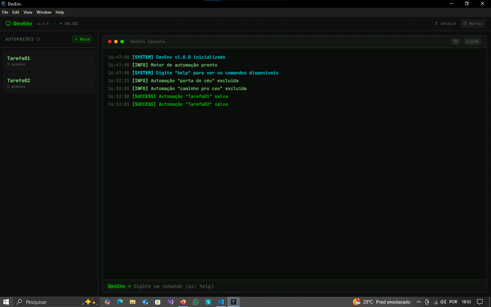
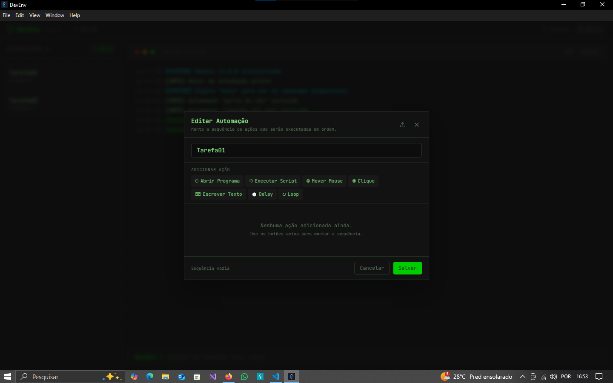

DevEnv

DevEnv is a desktop automation and development environment orchestrator built with Electron and a native Go backend. The application is designed to perform system-level operations, execute development tasks, and automate environment setup with high performance and reliability.

This project demonstrates advanced integration between a JavaScript-based UI layer and a compiled systems-language runtime, showcasing skills in process orchestration, inter-process communication (IPC), and native OS interaction.

Key Highlights
Native backend written in Go for performance and low-level system access
Electron + React frontend for cross-platform desktop UI
IPC bridge between Electron and Go processes
Concurrent task execution using goroutines
System command orchestration without external scripting languages
Packaged as a standalone desktop application
Architecture Overview

DevEnv uses a multi-process architecture to separate UI logic from system-level execution.

[ React UI ]
      │
      ▼
[ Electron Renderer ]
      │ IPC
      ▼
[ Electron Main Process ]
      │ stdio / process bridge
      ▼
[ Go Backend Binary ]
      │
      ▼
[ Operating System APIs ]
Responsibilities

Electron / React

User interface
State management
User interaction and configuration

Electron Main Process

Launching and managing the Go backend process
Handling IPC between renderer and backend

Go Backend

Executing system commands
Handling automation tasks
Managing concurrency and task orchestration
Interacting directly with the operating system
Technical Features
Native Process Management

The Go backend spawns and manages system processes directly, avoiding Node.js wrappers and ensuring predictable execution and performance.

Concurrency with Goroutines

Multiple automation tasks can run simultaneously using Go’s lightweight concurrency model, enabling efficient parallel execution.

Inter‑Process Communication (IPC)

Electron communicates with the Go backend through a structured IPC bridge, allowing the UI to trigger and monitor system operations in real time.

Cross‑Language Integration

This project demonstrates how to integrate:

a compiled language runtime (Go)
with a JavaScript desktop framework (Electron)

This architecture mirrors patterns used in professional desktop tooling and developer platforms.

Use Cases

DevEnv can be used to:

Automate development environment setup
Execute repetitive development commands
Manage local tooling and scripts from a graphical interface
Serve as a base architecture for other desktop automation tools
Tech Stack

Frontend

React
Electron
TailwindCSS

Backend

Go
Native OS process APIs

Build & Packaging

Electron Builder
Go compiler for producing standalone binaries
Project Structure
DevEnv/
├── backend/        # Go source code
├── electron/       # Electron main process
├── src/            # React renderer code
├── build/          # Compiled assets
└── package.json
Getting Started
Prerequisites
Node.js
Go
Install dependencies
npm install
Build Go backend
go build -o backend/bin/dev-env ./backend
Run in development mode
npm run dev
Build production application
npm run build
Example Workflow
User selects an automation task in the UI
Electron sends an IPC message to the main process
The main process forwards the request to the Go backend
The Go backend executes the system command
Output is streamed back to the UI in real time

This pipeline replicates real-world desktop orchestration tools used in developer platforms and enterprise automation software.

Why Go for the Backend

Go was chosen for:

fast startup time
compiled binaries with no runtime dependencies
strong concurrency model
safe and predictable system programming

This makes it ideal for desktop tools that need to execute system commands and manage multiple tasks simultaneously.

---
# Images

---

Future Improvements
Plugin system for custom automation tasks
Configuration profiles for different development stacks
Enhanced logging and task history
What This Project Demonstrates

This repository showcases practical experience with:

desktop application architecture
cross-language process orchestration
systems programming with Go
concurrent task execution
packaging and distributing production-ready software
License

MIT

Developed by Darwin.
